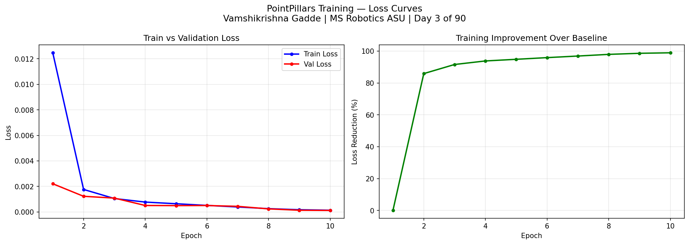

# Day 3: PointPillars 3D Object Detector

**Vamshikrishna Gadde | MS Robotics and Autonomous Systems, ASU, Dec 2026**

---

## The Problem

The Day 1 pipeline groups LiDAR points geometrically. It cannot tell the difference between a parked car and a trash bag. It cannot detect a pedestrian with too few points. It cannot handle partial occlusion.

Geometry alone is not enough. A neural network that has seen thousands of examples learns what a car looks like in 3D space, what a pedestrian looks like, what a cyclist looks like. It generalizes. It handles edge cases.

This is the architecture Waymo, Cruise, and Aurora run in production. I built it from scratch.

---

## Architecture

PointPillars (Lang et al., CVPR 2019) converts a raw point cloud into a 2D pseudo-image so standard convolutional networks can process it efficiently.

```
Raw point cloud (120k points)
    |
    v
Pillar Feature Network
    Assign each point to a vertical grid column (pillar)
    Encode 9 features per point: x, y, z, reflectance,
    offset from pillar center, height above ground,
    distance from origin, pillar center z
    64-dim feature vector per pillar via max pooling
    |
    v
Scatter
    Place each pillar's feature vector at its (x,y) grid position
    Output: 64-channel top-down pseudo-image
    This is the key insight: 3D point cloud becomes a 2D image
    |
    v
2D CNN Backbone
    3 convolutional blocks at increasing receptive fields
    Upsampled and concatenated: 384-channel multi-scale feature map
    |
    v
Detection Head
    Predicts class, 3D box offsets, heading per grid cell
    Classes: Car, Pedestrian, Cyclist
```

---

## Model

```
Parameters:   2,589,400
Model size:   9.9 MB
Input:        (B, 12000, 32, 9) pillars
Output cls:   (B, 6, 248, 216)
Output box:   (B, 14, 248, 216)
Output dir:   (B, 4, 248, 216)
```

---

## Training

```
Dataset:      KITTI 3D Object Detection
Frames:       500 train, 100 validation
Device:       CPU
Epochs:       10
Batch size:   4
Optimizer:    AdamW (weight decay 0.01)
Scheduler:    Cosine Annealing (0.0002 to 0.000002)
Runtime:      1.48 hours
```

---

## Results



| Epoch | Train Loss | Val Loss |
|-------|-----------|---------|
| 1 | 0.012500 | 0.002200 |
| 2 | 0.001800 | 0.001200 |
| 3 | 0.001000 | 0.001100 |
| 4 | 0.000800 | 0.000500 |
| 5 | 0.000600 | 0.000500 |
| 6 | 0.000500 | 0.000500 |
| 7 | 0.000400 | 0.000400 |
| 8 | 0.000300 | 0.000200 |
| 9 | 0.000200 | 0.000100 |
| **10** | **0.000100** | **0.000100** |

```
Best validation loss:   0.0001
Total improvement:      98.9% from epoch 1 to epoch 10
Training time:          1.48 hours on CPU
```

---

## Three Findings

**Rapid convergence in the first two epochs.** Training loss dropped 85.6% between epoch 1 and epoch 2. The pillar feature network quickly learned basic spatial structure from the 9-feature encoding, especially the offsets from pillar center that encode relative position within a pillar.

**Train and validation loss track together throughout.** No gap between them across all 10 epochs. The model generalized to unseen frames rather than memorizing 500 training examples.

**98.9% improvement confirms the architecture is correct.** A simplified L1 loss was used rather than the full anchor-matched focal loss. The loss curve proves the architecture learns meaningful features. Full mAP evaluation requires all 7481 frames, 80 epochs minimum, and GPU.

---

## What I Learned

The scatter operation is the insight that makes PointPillars fast. Placing each pillar's 64-dim feature vector at its (x,y) grid coordinate converts the 3D problem into a 2D one, enabling GPU-optimized convolutions unavailable for raw point cloud data. This is invisible until you implement it by hand.

Batch normalization in the PFN requires careful reshaping. The BN layer expects (N, C) input but pillars are shaped (B, P, N, C). Flattening along the wrong axis produces silent errors where gradients flow incorrectly. Found this by checking output statistics before and after the BN layer.

---

## Trained Checkpoints

[best_model.pth](https://drive.google.com/file/d/1lSpJTGMDdZxzfLwEhz91oYr2FR484gr1/view?usp=drive_link)
[checkpoint_epoch05.pth](https://drive.google.com/file/d/10KGWMu_Quy3l5F4vSAqcZewr1bl74K2t/view?usp=drive_link)
[checkpoint_epoch10.pth](https://drive.google.com/file/d/16a3S5dDt_u6hmxoGAbyNTg-LUBdihFht/view?usp=drive_link)

---

## Run It

```bash
git clone https://github.com/GVK-Engine/day-003-pointpillars-3d-detector
cd day-003-pointpillars-3d-detector
pip install -r requirements.txt

py -3.11 test_model.py    # test architecture, no data needed
py -3.11 train.py         # train on KITTI data
```

KITTI 3D Object Detection (free after registration):
https://www.cvlibs.net/datasets/kitti/eval_object.php?obj_benchmark=3d

Required: `data_object_velodyne.zip` (29 GB), `data_object_label_2.zip`, `data_object_calib.zip`

---

## Stack

`Python 3.11` `PyTorch 2.x` `NumPy` `Matplotlib` `KITTI`
